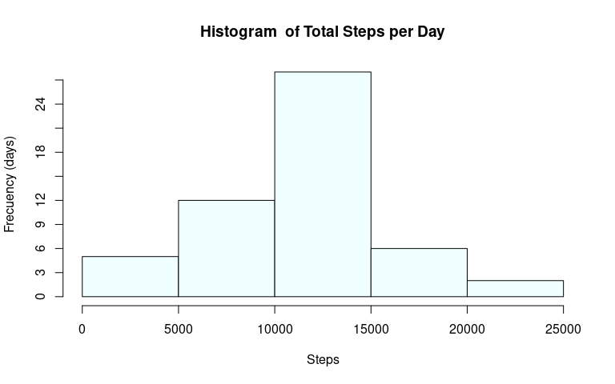
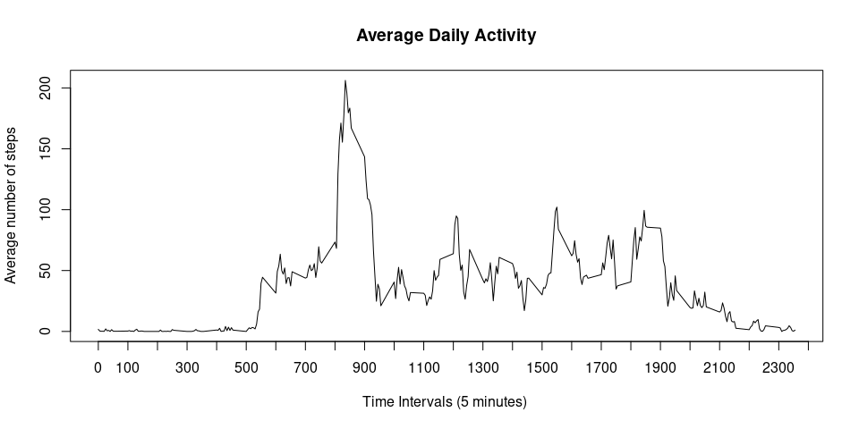
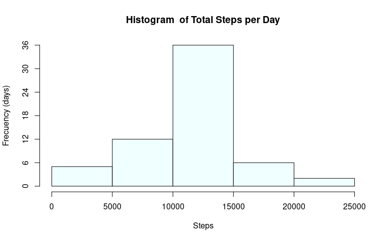
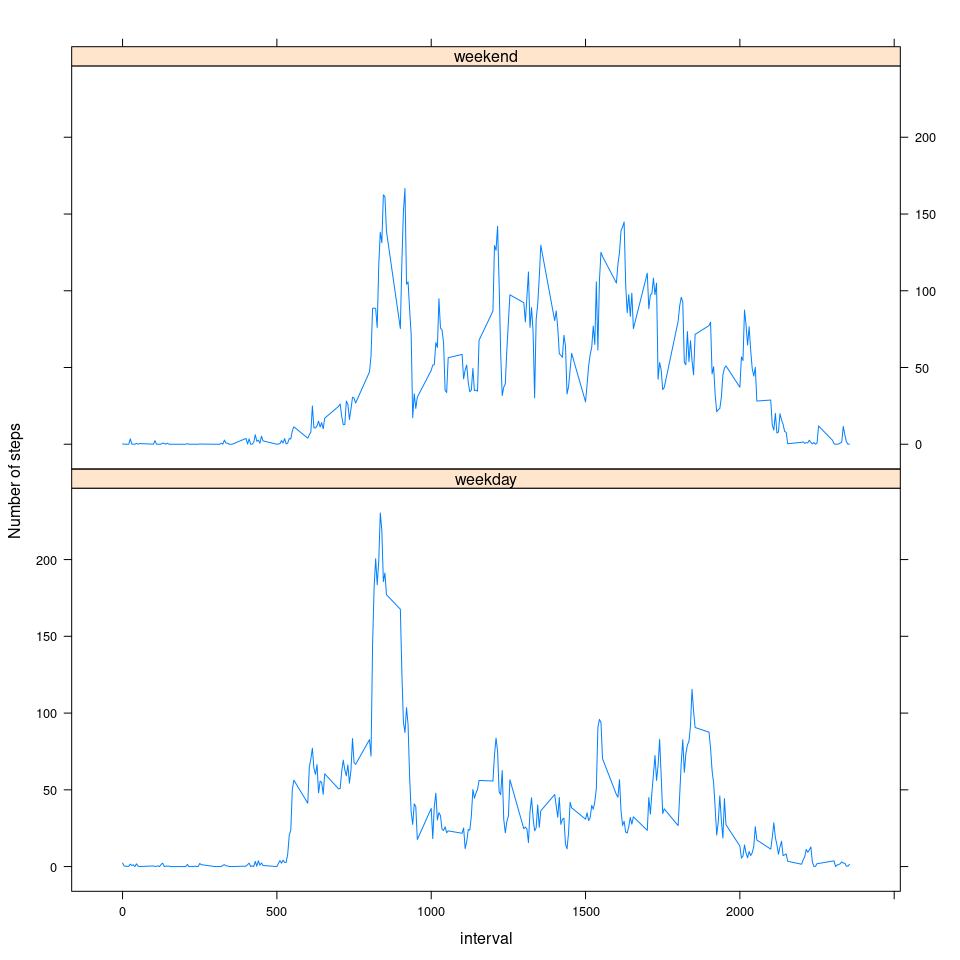

## Loading and preprocessing the data


The code necessary to load the data into R:   
  
  

```r
link <- "https://d396qusza40orc.cloudfront.net/repdata%2Fdata%2Factivity.zip"
download.file(link, "activity.zip")
data <- read.table(unzip("activity.zip", "activity.csv"), sep = ",", header = TRUE,
                   stringsAsFactors = FALSE)
```
  

The date variable is convert from a character format to a date format.   
    
  

```r
data$date <- as.Date(data$date, format = "%Y-%m-%d")
```


## What is mean total number of steps taken per day?

Calculating the total number of steps taken per day and plotting the histogram: 

```r
data2 <- data[,1:2]
steps_total <- tapply(data2$steps, data2$date, sum)
hist(steps_total, main =  "Histogram  of Total Steps per Day", 
     xlab = "Steps", freq = TRUE, ylab = "Frecuency (days)", 
      col = "azure1", yaxp = c(0,27, 9))
```


The mean and median values of the total number of steps taken per day are:

```r
c(Mean= mean(steps_total, na.rm = TRUE),
  Median =median(steps_total, na.rm = TRUE))
```

```
##     Mean   Median 
## 10766.19 10765.00
```

## What is the average daily activity pattern?

Generating a data frame with the average number of steps taken per 5- minutes  intervals.


```r
data3<- data[,c(1,3)]
daily_activity <- tapply(data3$steps, data3$interval, mean, na.rm = TRUE)
daily_activity <- data.frame(interval= as.numeric(names(daily_activity)),
                             steps = daily_activity, row.names = NULL)
```

Creating the time series plot of the average  daily activity of the subject: 


```r
plot(daily_activity, type = "l", xaxp = c(0, 2400, 24), 
     main = "Average Daily Activity", ylab = "Average number of steps", 
     xlab = "Time Intervals (5 minutes) ")
```



The interval that shows the maximum numbers of steps is the 835 with 206.17 steps in average: 

```r
x <- which.max(daily_activity$steps)
round(daily_activity[x, ],2)
```

```
##     interval  steps
## 104      835 206.17
```


## Imputing missing values

As we can see, the total number of NA values is 2304, all of them in the *steps* variable: 


```r
apply(data, 2, function (x) {sum(is.na(x))})
```

```
##    steps     date interval 
##     2304        0        0
```
Replacing the NA values with  the mean of the respective 5-minute interval:  


```r
data_clean <- data
mean <- tapply(data_clean$steps, data_clean$interval, mean, na.rm = TRUE)
mean<- data.frame(interval= as.numeric(names(mean)),
                             steps = mean, row.names = NULL)
for (i in 1:17568)
if(is.na(data_clean[i,1])){
 x<- match(data[i,3], mean[,1])
 data_clean[i,1] <- mean[x,2]
}
```

The new dataset without  missing values is called *data_clean*, we can check it with the same code of the start:


```r
apply(data_clean, 2, function (x) {sum(is.na(x))})
```

```
##    steps     date interval 
##        0        0        0
```

When the histogram is plotted with the new dataset, the frequency of the interval 10000-15000 steps increases from 27 to 36 days.   

```r
data2_clean <- data_clean[,1:2]
steps_total <- tapply(data2_clean$steps, data2_clean$date, sum)
hist(steps_total, main =  "Histogram  of Total Steps per Day", 
     xlab = "Steps", freq = TRUE, ylab = "Frecuency (days)", 
      col = "azure1", yaxp = c(0,36, 6))
```



The mean of total steps taken per day doesn't change while the median changes a bit (from 10765 to 10766.19).


```r
c(Mean= mean(steps_total),
  Median =median(steps_total))
```

```
##     Mean   Median 
## 10766.19 10766.19
```

## Are there differences in activity patterns between weekdays and weekends?

Creating the new factor variable:


```r
days <- weekdays(data_clean[,2], abbreviate = TRUE)
days <- sub("Sun|Sat", "weekend", days)
days <- sub("Mon|Tue|Wed|Thu|Fri", "weekday", days)
data_clean$days <- days 
```

Generating the new data frame with the average number of steps taken per interval for weekday days and weekend days:


```r
activity_pattern <- split(data_clean, data_clean$days)
activity_pattern <- lapply(activity_pattern, function(x) {tapply(x$steps, x$interval, mean) })
days <- rep(names(activity_pattern), each = 288)
interval <- c(names(activity_pattern[[1]]), names(activity_pattern[[2]]))
steps <- c(activity_pattern[[1]], activity_pattern[[2]])
activity_pattern <- data.frame(days = days, interval = as.numeric(interval), steps = steps)
```

As can be seen in the time series plot there are differences in the activity patterns between weekdays and weekends:  
  

```r
library(lattice)
xyplot(steps ~ interval | days, data = activity_pattern, type= "l",
       layout = c(1,2), ylab = "Number of steps " )
```



